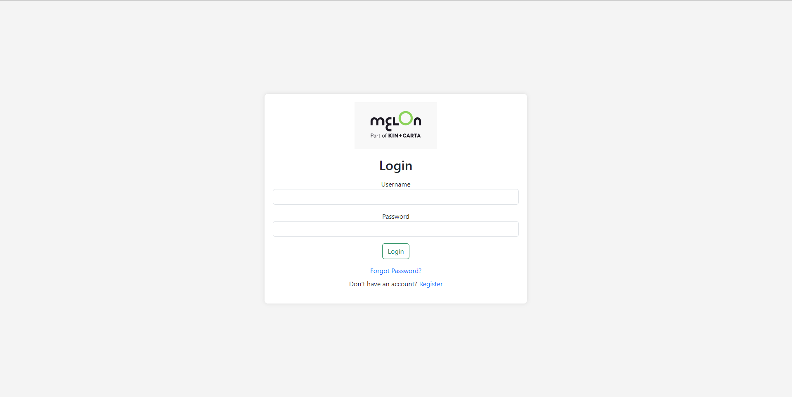
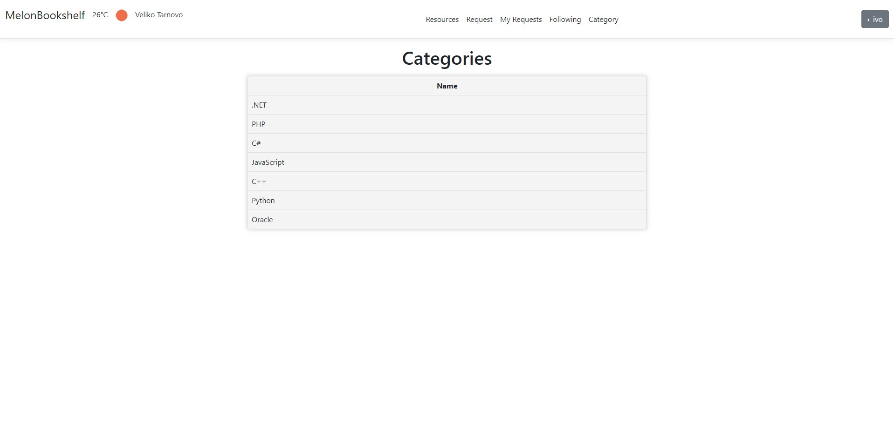
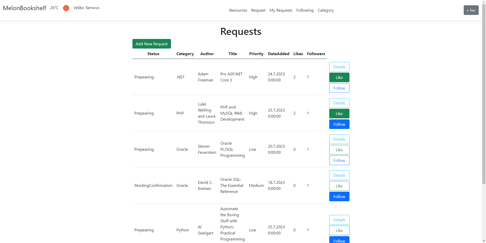
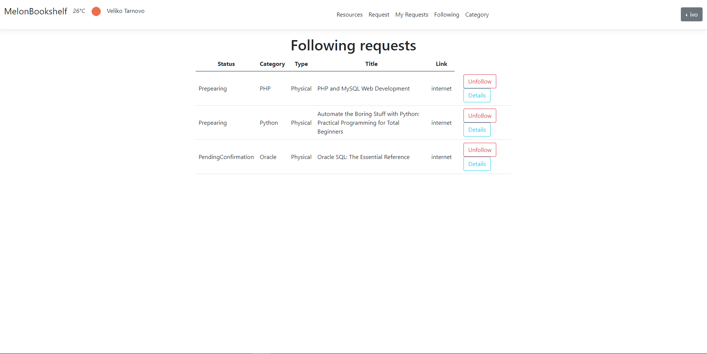
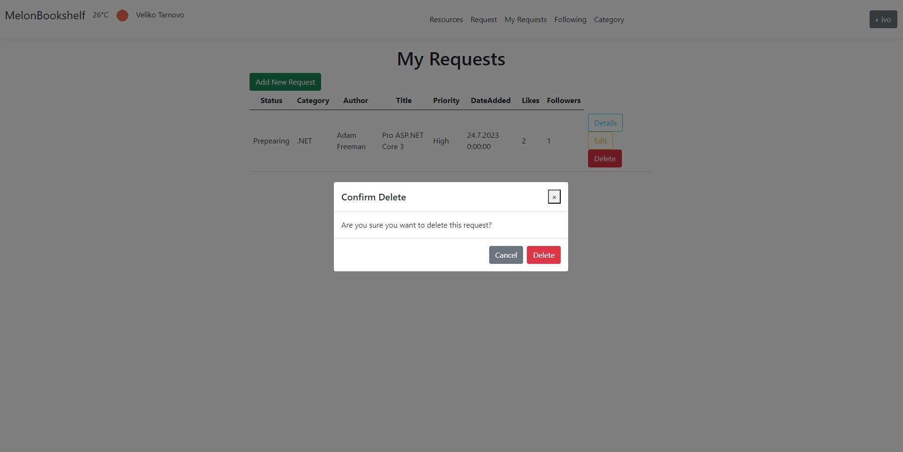

# BookshelfMelon

BookshelfMelon is a sophisticated web application built with ASP.NET Core 6.0 that serves as a digital resource management and sharing platform. It allows users to manage, share, and discover various resources while providing robust administrative features for content moderation.

## 🚀 Features

### User Management

- User registration and authentication
- Profile management with customizable details
- User following system
- Role-based access control (Admin and User roles)

### Resource Management

- Create, read, update, and delete resources
- Categorized resource organization
- Resource request system
- File storage and management
- Resource sharing capabilities

### Administrative Features

- Comprehensive admin dashboard
- Report generation in Excel format
- User activity monitoring
- Content moderation tools

### Additional Features

- Email notifications
- API versioning support
- Swagger API documentation
- Secure user data handling
- Responsive design for various devices

## 🛠 Technology Stack

- **Framework**: ASP.NET Core 6.0
- **Database**: Microsoft SQL Server with Entity Framework Core
- **Authentication**: ASP.NET Core Identity
- **API Documentation**: Swagger/OpenAPI
- **Reporting**: EPPlus for Excel report generation
- **Email Service**: MailKit
- **Object Mapping**: AutoMapper
- **Frontend**: ASP.NET MVC with Razor views

## 📸 Screenshots

Here's a visual tour of BookshelfMelon's key features:

### Authentication




### Main Features








### Administrative Features





## 🚦 Getting Started

### Prerequisites

- .NET 6.0 SDK
- SQL Server
- Visual Studio 2022 (recommended) or VS Code

### Installation Steps

1. Clone the repository
2. Update the connection string in `appsettings.json`
3. Open the solution in Visual Studio
4. Run the following commands in Package Manager Console:
   ```
   Update-Database
   ```
5. Build and run the application

## 📝 Configuration

The application requires several configuration settings in `appsettings.json`:

- Database connection string
- Email service settings
- File storage configuration
- Authentication settings

## 📄 License

This project is licensed under the MIT License - see the LICENSE file for details.
