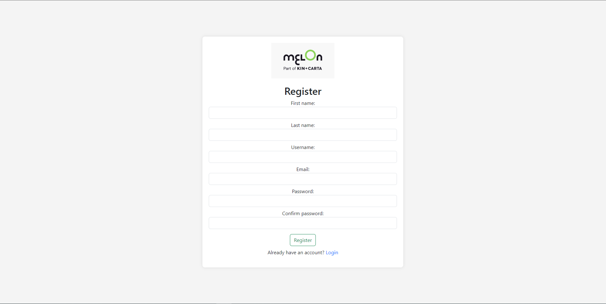
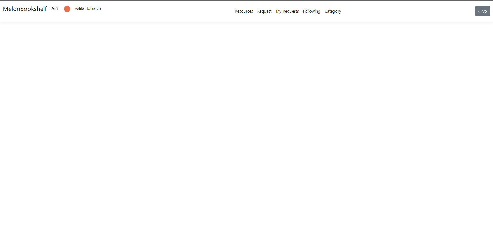

📚 MelonBookshelf
A modern web application for managing and sharing digital resources, built with ASP.NET Core MVC.

## 📈 Status: Production Ready

The application is fully functional and includes comprehensive resource management, user authentication, and administrative features.

## 👉 Built With:

- ASP.NET Core MVC 6.0
- Entity Framework Core
- Microsoft SQL Server
- ASP.NET Core Identity
- AutoMapper
- EPPlus (Excel Report Generation)
- MailKit (Email Services)
- Bootstrap (UI Framework)

## ✨ Features

✅ User Authentication & Authorization

- Complete user management system
- Role-based access control
- Email verification
- Password reset functionality

✅ Resource Management

- Digital resource cataloging
- Category organization
- Resource requests
- File upload and storage
- Resource commenting system
- Comment replies

✅ Administrative Features

- User management
- Category management
- Resource approval workflow
- Report generation
- Background task processing

✅ Additional Features

- Weather service integration
- Email notifications
- Sitemap generation
- Excel report generation

## 🔐 Security Features

- HTTPS enforcement
- Cross-Site Request Forgery (CSRF) protection
- Secure password hashing
- Role-based authorization
- Input validation and sanitization

## 📊 Reporting

- Excel report generation

## 🔄 Background Tasks

- Automated email sending
- Report generation
- Weather data updates
- System maintenance tasks
- Scheduled data processing

## 🎨 Frontend Features

- Responsive Bootstrap design
- jQuery for dynamic interactions
- AJAX for seamless updates
- Client-side validation
- Rich text editing
- File upload with preview
- Modal dialogs
- Toast notifications

## 📸 Screenshots

Here's a visual tour of BookshelfMelon's key features:

### Authentication

### Main Features

### Administrative Features

